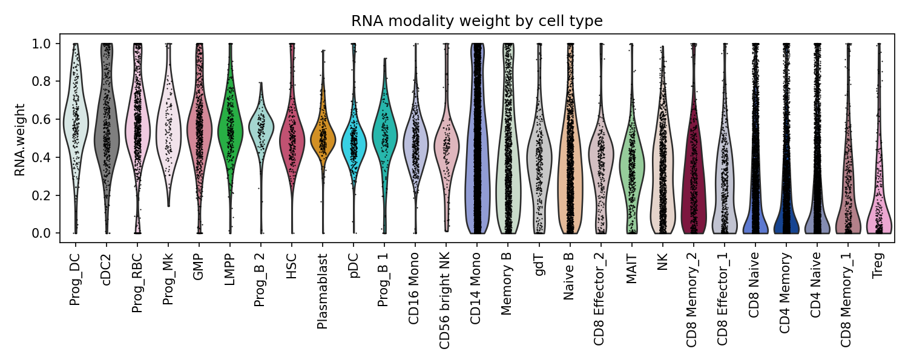
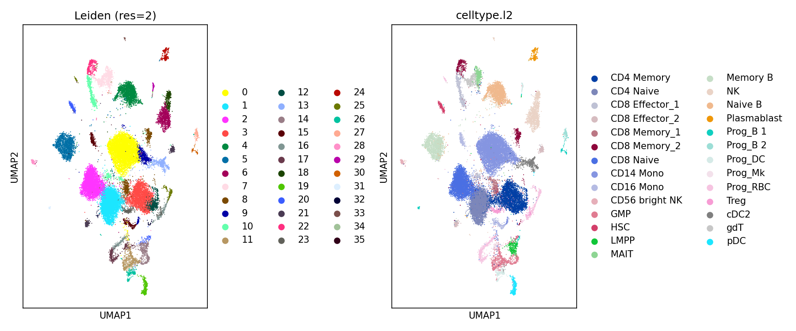

**Project status:** Ongoing methodological reproduction project.  
**Main purpose:** Understanding and reproducing the algorithmic steps of Seurat v4 WNN in Python/R.

# Python Reimplementation of Seurat Weighted Nearest Neighbor Analysis

This repository contains a Python/R methodological reproduction of the Seurat v4 Weighted Nearest Neighbor (WNN) workflow for multimodal single-cell RNA and ADT data integration.

The purpose of this project is to understand and reproduce the key algorithmic steps of WNN, including modality-specific preprocessing, KNN/SNN graph construction, Jaccard-based bandwidth estimation, cell-specific RNA/ADT modality weighting, WNN graph construction, clustering, and UMAP visualization.

This is an educational and methodological reproduction project. It is not an official Seurat implementation.

## Background

Weighted Nearest Neighbor analysis is a multimodal single-cell integration strategy introduced in Seurat v4. It learns cell-specific modality weights and constructs a weighted multimodal neighbor graph that can be used for downstream visualization, clustering, and biological interpretation.

In this project, I focused on reproducing the WNN workflow step by step using Python, while using R/Seurat outputs as references for cross-checking intermediate results.

## Repository Structure

```text
.
├── src/
│   ├── wnn_v4.py          # Core Python implementation of the WNN algorithm
│   ├── pipeline.py        # Full Python pipeline from R-exported raw counts to WNN, UMAP, and plots
│   └── Normalize.py       # Python implementation of Seurat-like preprocessing steps
├── scripts/
│   └── wnn_manual.R       # Step-by-step R/Seurat script for exporting intermediate reference results
├── figures/
│   ├── violin_rna_weight.png
│   └── wnn_umap.png
└── README.md
```

## Main Components

### `src/Normalize.py`

This file implements Seurat-like preprocessing utilities in Python:

* `NormalizeData`
* `FindVariableFeatures`
* `ScaleData`
* `RunPCA`

These functions are used to reproduce key preprocessing steps before WNN graph construction.

### `src/wnn_v4.py`

This script focuses on reproducing the core WNN algorithm from precomputed RNA and ADT PCA embeddings. Major steps include:

* L2 normalization of RNA and ADT PCA embeddings
* Batched KNN search for each modality
* Jaccard/SNN graph construction
* Jaccard-based sigma bandwidth estimation
* Within- and cross-modality prediction
* Kernel similarity and modality affinity calculation
* Cell-specific RNA/ADT modality weight estimation
* Weighted nearest-neighbor graph construction
* WNN-SNN graph construction
* Step-by-step comparison with R-exported intermediate results
* UMAP and Leiden clustering

### `src/pipeline.py`

This script provides a fuller Python workflow starting from R-exported raw count matrices. It includes:

* Loading RNA and ADT count matrices exported from R
* RNA preprocessing: LogNormalize, variable feature selection, scaling, PCA
* ADT preprocessing: CLR normalization, scaling, PCA
* WNN graph construction
* UMAP and Leiden clustering
* RNA modality weight visualization by cell type

### `scripts/wnn_manual.R`

This R script reproduces WNN-related intermediate steps using Seurat-style objects and exports intermediate results to CSV files. These outputs are used to cross-check the Python implementation step by step.

The exported values include KNN indices, KNN distances, sigma bandwidths, within/cross-modality prediction distances, kernel similarities, modality affinities, and final RNA/ADT modality weights.

## Example Results

### RNA modality weight by cell type



This plot summarizes the distribution of RNA modality weights across annotated cell types. It helps evaluate whether the learned modality weights are biologically meaningful across different immune cell populations.

### WNN UMAP visualization



This figure compares WNN-based Leiden clustering with reference cell-type annotations on the UMAP embedding.

## Installation

Create a Python environment and install the required packages:

```bash
conda create -n wnn-python python=3.10
conda activate wnn-python

pip install numpy pandas scipy matplotlib scikit-learn statsmodels scanpy torch
pip install python-igraph leidenalg
```

For the R reference script, install the following R packages:

```r
install.packages(c("RANN", "Matrix"))
install.packages("Seurat")
```

Depending on your R version and system configuration, Seurat installation may require additional dependencies.

## Usage

### 1. Run the R reference script

The R script assumes that a Seurat object named `bm` is available in the R environment.

```r
source("scripts/wnn_manual.R")
```

This exports intermediate WNN-related results to CSV files for Python cross-checking.

### 2. Run the core Python WNN reproduction

```bash
python src/wnn_v4.py
```

This script loads precomputed RNA/ADT PCA embeddings and compares Python-computed intermediate values with R-exported reference outputs.

### 3. Run the full Python pipeline

```bash
python src/pipeline.py
```

This script runs preprocessing, WNN graph construction, UMAP visualization, Leiden clustering, and RNA modality weight plotting.

## Data Availability

Raw single-cell data and large intermediate files are not included in this repository.

The current scripts assume that RNA/ADT matrices and R-exported intermediate files are available locally. Before running the scripts, users need to prepare the required input files and update the file paths accordingly.

Expected input files include examples such as:

```text
rna_raw_from_R.mtx
adt_raw_from_R.mtx
rna_genes_from_R.csv
rna_cells_from_R.csv
adt_features_from_R.csv
rna_variable_features_R.csv
celltype_R.csv
rna_pca.csv
adt_pca.csv
rna_weight_seurat.csv
```

## Notes

Some scripts currently contain local file paths from the development environment. Before reuse, replace these paths with your own local paths or refactor them into relative paths, for example:

```python
from pathlib import Path

BASE_DIR = Path(__file__).resolve().parents[1]
DATA_DIR = BASE_DIR / "data"
OUT_DIR = BASE_DIR / "outputs"
```

This repository is intended to demonstrate algorithmic understanding and reproducible implementation of WNN-related steps rather than provide a ready-to-use general-purpose software package.

## Current Limitations

- The current version is a methodological reproduction rather than a packaged software tool.
- Some scripts still contain local development paths and need to be refactored before general reuse.
- Raw single-cell count matrices and large intermediate files are not included in this repository.
- Reproduction currently requires users to prepare R-exported Seurat intermediate files manually.

## References

* Hao, Y. et al. Integrated analysis of multimodal single-cell data. Cell, 2021.
* Seurat Weighted Nearest Neighbor Analysis: https://satijalab.org/seurat/articles/weighted_nearest_neighbor_analysis
* Seurat multimodal analysis vignette: https://satijalab.org/seurat/articles/multimodal_vignette

## Author

Zhihan Peng

Personal website: https://zhihannnn.github.io
GitHub: https://github.com/zhihannnn
ORCID: https://orcid.org/0009-0003-2259-3484
